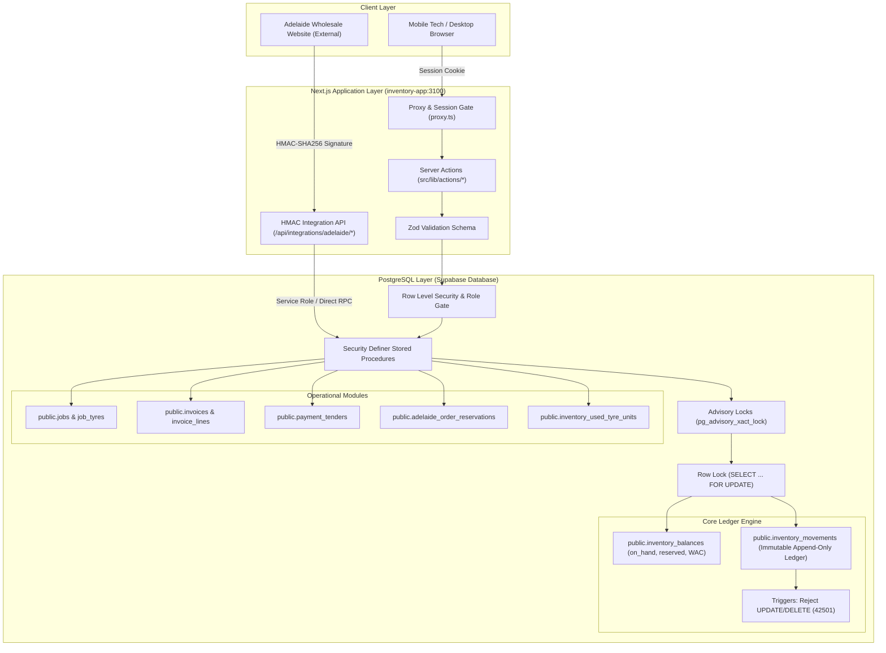
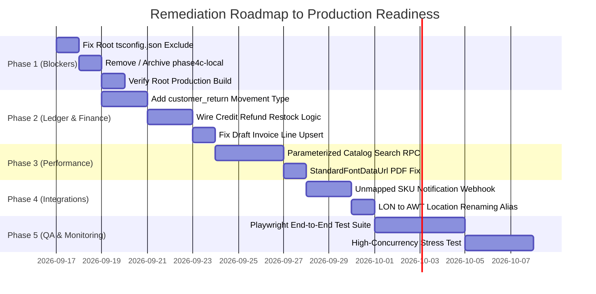

# Production-Readiness Audit Report: 24/7 Truck Tyre Services
**Target System:** Inventory Application (`inventory-app`) & Root Operational Monorepo
**Auditor:** Senior Staff Software Engineer, Database Architect & Security Auditor
**Date:** September 16, 2026
**Repository Branch:** `fix/inventory-branch-safety-ci`
**Evaluation Status:** **CONDITIONAL PASS — PRODUCTION READY WITH PHASE 1/2 REMEDIATIONS**

---

## 1. Executive Summary

### 1.1 Purpose & Scope
This audit is a comprehensive, production-readiness review of the **24/7 Truck Tyre Services** software platform, centered on the standalone internal operations platform located in `inventory-app/` (`247-truck-tyre-inventory`), and its interaction with the public marketing website in the root directory (`247trucktyreservices.com.au`), as well as the external e-commerce integration (`Adelaide Wholesale Tyres`).

The evaluation covers:
1. Double-entry immutable stock ledger architecture and inventory balance consistency.
2. Sales, job completion proofs, invoicing (manual, job-linked, POS), and payment recording.
3. Database schemas, check constraints, advisory locking, and race-condition safety.
4. Security model, Row Level Security (RLS) policies, and role-based access control (RBAC).
5. HMAC-SHA256 authenticated e-commerce reservation and inventory synchronization API.
6. TypeScript typing hygiene, static analysis, unit test suites, and production build pipelines.

---

### 1.2 High-Level Assessment
The core inventory ledger and database architecture in `inventory-app` is **exceptionally well-engineered**. It demonstrates enterprise-grade database discipline that surpasses typical Next.js/Supabase boilerplates:
- Inventory balance mutation is strictly mediated by security-definer stored procedures that acquire row-level (`SELECT FOR UPDATE`) or advisory (`pg_advisory_xact_lock`) locks.
- `public.inventory_balances` is protected by strict non-negative check constraints (`on_hand >= 0`, `reserved >= 0`, `reserved <= on_hand`).
- `public.inventory_movements` functions as an immutable, append-only ledger protected by database triggers that reject `UPDATE` and `DELETE` operations at the database engine level (error `42501`).
- Double stock deductions between jobs and invoices are structurally impossible due to cryptographic-style completion proofs (`private.finance_completion_proof`) and the enforcement of service-only restrictions on manual invoices (`MANUAL_INVOICE_SERVICE_ONLY`).

However, **several operational and architectural gaps must be remediated prior to full enterprise production deployment**:
1. **Root Monorepo Build Leakage (P0)**: The root Next.js marketing application fails TypeScript compilation and production build because an untracked worktree directory (`phase4c-local/`) is inadvertently included by the root `tsconfig.json`.
2. **Missing Customer Return Ledger Movement (P1)**: The ledger lacks a native `customer_return` movement type. When credit refunds are issued to customers for returned tyres, the financial refund is recorded, but physical stock cannot be automatically restocked into the balance ledger.
3. **Query Planner Inlining Blocker on Product Summary View (P1)**: `public.inventory_product_summary` calls a `SECURITY DEFINER` function `private.inventory_product_summary()`. PostgreSQL cannot push down `WHERE`, `LIMIT`, and `OFFSET` clauses into security-definer set-returning functions, materializing the entire product catalog in memory before filtering.
4. **Legacy Location Naming Discrepancy (P2)**: Warehouse code `LON` (originally "London Road") was re-assigned to "AWT Tyres Website" warehouse, causing semantic friction between database IDs and UI labels.

---

### 1.3 Scorecard & Maturity Matrix

| System Dimension | Score (1-10) | Rating | Key Justification |
| :--- | :---: | :---: | :--- |
| **Double-Entry Ledger Integrity** | **9.5** | Excellent | Append-only triggers, non-negative checks, WAC formula in DB, strict direction constraints. |
| **Concurrency & Lock Safety** | **9.5** | Excellent | Explicit `SELECT FOR UPDATE` and transaction advisory locks prevent race-condition overselling. |
| **Sales & Invoice Double-Deduction Protection** | **9.5** | Excellent | Strict separation between job stock deductions and invoice billing; completion proofs verified. |
| **Database & Schema Architecture** | **9.0** | Excellent | 53 well-structured, incremental migrations; foreign key constraints and cascade rules sound. |
| **Security & Row Level Security (RLS)** | **9.0** | Excellent | RLS enabled on all business tables; WAC column revoked from `authenticated` role; HMAC API. |
| **Unit Test Coverage (Inventory App)** | **8.5** | Very Good | 57 test files, 382 passing unit tests covering WAC math, reservations, locks, and invoices. |
| **UI/UX Resilience & Component Architecture** | **8.0** | Good | Clean Next.js App Router structure; Zod validation; standard toasts; standard PDF rendering. |
| **Catalog Scalability & Query Performance** | **6.5** | Moderate | View wrapping `SECURITY DEFINER` function blocks query predicate pushdown. |
| **Monorepo & Build Hygiene** | **6.0** | Needs Work | Root `tsconfig.json` fails build due to unexcluded `phase4c-local` artifacts. |

---

## 2. Architecture & Data Flow Map

### 2.1 Monorepo Structural Map
The repository consists of two separate, decoupled Next.js 16.3.3 applications:
```
C:\Users\abuba\247truck
├── app/                        <-- Public Marketing Website (Port 3000)
│   ├── api/contact/route.ts    <-- Enquiry delivery via Resend
│   └── ...                     <-- Services, Roadside Fleet Membership, Wheel Alignment
├── inventory-app/              <-- Internal Inventory & ERP Platform (Port 3100)
│   ├── src/
│   │   ├── app/                <-- App Router (Dashboard, Tyres, Jobs, Invoices, POS, Transfer)
│   │   ├── components/         <-- UI Components, Modals, Forms
│   │   └── lib/
│   │       ├── actions/        <-- Server Actions (Mutation entry points)
│   │       ├── api/            <-- Supabase browser and server clients
│   │       ├── pdf/            <-- PDF invoice generation engine
│   │       └── types/          <-- TypeScript domain contracts
│   └── supabase/
│       └── migrations/         <-- 53 PostgreSQL migrations (Source of truth)
└── phase4c-local/              <-- Untracked legacy worktree (Causes root build breakage)
```

---

### 2.2 System Flow Architecture (End-to-End Diagram)



---

## 3. Critical Findings (P0 - Blocker)

### [P0-1] Root Monorepo Build Failure Due to Untracked Worktree Leakage
* **Severity:** **P0 - Blocker**
* **Affected Component:** Root Marketing Site Build & Typecheck (`C:\Users\abuba\247truck`)
* **Affected Files:**
  * [`C:\Users\abuba\247truck\tsconfig.json`](file:///C:/Users/abuba/247truck/tsconfig.json)
  * Untracked directory: `C:\Users\abuba\247truck\phase4c-local\`
* **Problem Description:**
  Running `npm run typecheck` or `npm run build` in the root project fails with fatal TypeScript compilation errors:
  ```
  phase4c-local/src/lib/actions/inventory.ts(232,54): error TS2737: BigInt literals are not available when targeting lower than ES2020.
  phase4c-local/src/lib/actions/pos.ts(6,10): error TS2305: Module '"@/lib/api/supabase-server"' has no exported member 'createClient'.
  ```
* **Root Cause Analysis:**
  The root `tsconfig.json` contains `"include": ["next-env.d.ts", "**/*.ts", "**/*.tsx", ".next/types/**/*.ts"]` without excluding standalone subdirectories or abandoned worktree clones. The root TypeScript compiler crawls into `phase4c-local/`, attempting to compile an older snapshot of the inventory codebase with outdated compiler targets and mismatched module paths.
* **Operational Impact:**
  Any CI/CD pipeline that runs root linting, typechecking, or `next build` will immediately fail, blocking all automated deployments and hotfixes for the public website.
* **Remediation:**
  Update `C:\Users\abuba\247truck\tsconfig.json` to explicitly exclude `phase4c-local` and any sibling sub-projects:
  ```json
  "exclude": [
    "node_modules",
    "inventory-app",
    "phase4c-local",
    "inventory-backup-phase1-5"
  ]
  ```
  Alternatively, remove or archive the untracked directory `phase4c-local` outside of the Git working tree.

---

## 4. High-Priority Findings (P1)

### [P1-1] Lack of Native Customer Return Movement Type in Ledger Engine
* **Severity:** **P1 - High**
* **Affected Modules:** Invoicing V2, Credit Refunds, Inventory Movements Ledger
* **Affected Files & Database Objects:**
  * Migration: [`inventory-app/supabase/migrations/20260911100000_invoicing_v2_system.sql`](file:///C:/Users/abuba/247truck/inventory-app/supabase/migrations/20260911100000_invoicing_v2_system.sql)
  * Migration: [`inventory-app/supabase/migrations/20260303000001_phase1_inventory_foundation.sql`](file:///C:/Users/abuba/247truck/inventory-app/supabase/migrations/20260303000001_phase1_inventory_foundation.sql)
  * Types: [`inventory-app/src/lib/types/inventory.ts`](file:///C:/Users/abuba/247truck/inventory-app/src/lib/types/inventory.ts)
  * Stored Procedure: `public.create_invoice_credit_refund()`
  * Table Constraint: `public.inventory_movements_movement_type_check`
* **Problem Description:**
  When a customer returns a purchased tyre and receives a credit note or cash refund via `create_invoice_credit_refund`, the financial ledger is credited correctly, but **physical stock is completely untouched by the system**. There is no `customer_return` movement type in the database check constraint:
  ```sql
  CONSTRAINT inventory_movements_movement_type_check CHECK (
    movement_type IN (
      'purchase_receipt', 'stock_out', 'transfer_out', 'transfer_in',
      'adjustment', 'opening_stock', 'quick_stock_in', 'used_unit_in', 'used_unit_out'
    )
  )
  ```
* **Root Cause Analysis:**
  The Invoicing V2 migration (`20260911100000`) designed `create_invoice_credit_refund` as a pure financial credit refund. To return physical tyres to stock, warehouse staff must manually perform either a `quick_stock_in` (which forces them to invent a supplier invoice number and unit cost) or an `adjustment` (which implies a stocktake counting error rather than a customer return).
* **Operational Impact:**
  1. Returned inventory either sits in the depot unrecorded, or is re-added via `quick_stock_in` with an arbitrary cost that corrupts the Weighted Average Cost (WAC).
  2. Inventory audit trails lack linkage between the returned invoice line and the returned physical tyre.
* **Remediation:**
  1. Add `'customer_return'` to `inventory_movements_movement_type_check` and allow positive deltas in `inventory_movements_direction_check`.
  2. Enhance `create_invoice_credit_refund` with an optional `p_restock_items JSONB` parameter that invokes `post_inventory_movement(..., 'customer_return', ...)` using the original sale item's historical cost basis to restore stock without skewing WAC.

---

### [P1-2] Query Planner Pushdown Blocker on `public.inventory_product_summary`
* **Severity:** **P1 - High**
* **Affected Modules:** Inventory Catalog, Product Search, Performance
* **Affected Files & Database Objects:**
  * Migration: [`inventory-app/supabase/migrations/20260914185720_secure_wac_surface.sql`](file:///C:/Users/abuba/247truck/inventory-app/supabase/migrations/20260914185720_secure_wac_surface.sql#L107-L149)
  * View: `public.inventory_product_summary`
  * Function: `private.inventory_product_summary()`
* **Problem Description:**
  In migration `20260914185720`, `public.inventory_product_summary` was converted into a view that selects from `private.inventory_product_summary()`:
  ```sql
  CREATE OR REPLACE VIEW public.inventory_product_summary AS
  SELECT * FROM private.inventory_product_summary();
  ```
  `private.inventory_product_summary()` is declared as a `SECURITY DEFINER` function that performs a multi-table join across `products`, `inventory_balances`, and `locations`.
* **Root Cause Analysis:**
  PostgreSQL query planner **cannot inline set-returning `SECURITY DEFINER` functions**. When an application executes:
  ```sql
  SELECT * FROM public.inventory_product_summary WHERE location_id = 'REG' AND sku = '29580225-HDC3' LIMIT 10;
  ```
  PostgreSQL cannot push the `WHERE` and `LIMIT` clauses into the function. Instead, it runs the entire join for all products across all locations, materializes the complete result set into memory, and only then applies the filter and limit.
* **Operational Impact:**
  While acceptable for a catalog of 200 tyres, once the inventory scales to 2,000+ tyres and multiple branches, browsing tyres or filtering by SKU in the UI will suffer high latency, CPU spikes, and memory consumption on the database server.
* **Remediation:**
  Provide an indexed, parameterized search RPC:
  ```sql
  CREATE OR REPLACE FUNCTION public.get_inventory_product_summary(
    p_location_id text DEFAULT NULL,
    p_search_query text DEFAULT NULL,
    p_limit int DEFAULT 50,
    p_offset int DEFAULT 0
  ) RETURNS TABLE (...) ...
  ```
  This allows PostgreSQL to execute index scans using `p_location_id` and `p_search_query` directly inside the query execution plan.

---

## 5. Medium-Priority Findings (P2)

### [P2-1] Legacy Location Code `LON` vs UI Label "AWT Tyres Website"
* **Severity:** **P2 - Medium**
* **Affected Modules:** Locations, Transfers, Stocktake
* **Affected Files & Database Objects:**
  * Migration: [`inventory-app/supabase/migrations/20260303000001_phase1_inventory_foundation.sql`](file:///C:/Users/abuba/247truck/inventory-app/supabase/migrations/20260303000001_phase1_inventory_foundation.sql#L7-L10)
  * Migration: [`inventory-app/supabase/migrations/20260912160000_adelaide_wholesale_integration.sql`](file:///C:/Users/abuba/247truck/inventory-app/supabase/migrations/20260912160000_adelaide_wholesale_integration.sql#L8-L10)
  * Type: [`inventory-app/src/lib/types/locations.ts`](file:///C:/Users/abuba/247truck/inventory-app/src/lib/types/locations.ts)
* **Problem Description:**
  The database initialized two branches: `REG` (Regency Park) and `LON` (London Road). In migration `20260912160000`, the description of `LON` was renamed to "AWT Tyres Website":
  ```sql
  UPDATE public.locations SET name = 'AWT Tyres Website' WHERE id = 'LON';
  ```
  However, the immutable primary key `LON` remains hardcoded across balance tables, foreign keys, transfer logs, and API routes.
* **Operational Impact:**
  Developers, warehouse staff, and auditors reading database logs encounter warehouse transfers between `REG` and `LON`, creating operational confusion because there is no London Road physical facility in current operations.
* **Remediation:**
  Document this alias clearly in developer guides, or plan an atomic migration to update `locations.id` from `LON` to `AWT` using `ON UPDATE CASCADE` across all foreign keys.

---

### [P2-2] Full Line Item Wipe on Manual Invoice Draft Updates
* **Severity:** **P2 - Medium**
* **Affected Modules:** Invoicing V2 Draft Editing
* **Affected Database Function:** `public.update_invoice_draft()`
  * Migration: [`inventory-app/supabase/migrations/20260911100000_invoicing_v2_system.sql`](file:///C:/Users/abuba/247truck/inventory-app/supabase/migrations/20260911100000_invoicing_v2_system.sql#L330-L365)
* **Problem Description:**
  When a user saves changes to a draft manual invoice, `update_invoice_draft` performs a destructive wipe and replace:
  ```sql
  DELETE FROM public.invoice_lines WHERE invoice_id = p_invoice_id;
  INSERT INTO public.invoice_lines (...) SELECT ...;
  ```
* **Operational Impact:**
  1. Every save changes the primary key `id` (UUID) of all line items on the draft.
  2. If an operator or integration has referenced a specific draft line UUID, that reference becomes a dangling pointer.
* **Remediation:**
  Implement an upsert pattern for draft updates that matches existing line items by `id` or line number, updating quantities/prices in-place and only deleting removed rows.

---

### [P2-3] StandardFontDataUrl Warning in Node.js PDF Generation
* **Severity:** **P2 - Medium**
* **Affected Modules:** Invoice PDF Engine
* **Affected Files:**
  * [`inventory-app/src/lib/pdf/invoice-pdf.ts`](file:///C:/Users/abuba/247truck/inventory-app/src/lib/pdf/invoice-pdf.ts)
* **Problem Description:**
  When generating invoice PDFs on the server side using `@react-pdf/renderer`, the console logs:
  `Warning: The standardFontDataUrl option is not specified. To allow font rendering to work correctly...`
* **Operational Impact:**
  Under high serverless load, unconfigured standard font URLs can result in font loading fallbacks, increased generation latency, or intermittent character rendering errors in generated tax invoices.
* **Remediation:**
  Explicitly configure font sources or register bundled TrueType/WOFF font files via `Font.register()` in `src/lib/pdf/invoice-pdf.ts`.

---

### [P2-4] Unmapped SKU Handling in E-Commerce Integration
* **Severity:** **P2 - Medium**
* **Affected Modules:** Adelaide Wholesale Tyres Integration API
* **Affected Files:**
  * [`inventory-app/src/app/api/integrations/adelaide/reservations/route.ts`](file:///C:/Users/abuba/247truck/inventory-app/src/app/api/integrations/adelaide/reservations/route.ts)
  * Table: `public.adelaide_product_mappings`
* **Problem Description:**
  When an online customer attempts to purchase a tyre that exists in Adelaide Wholesale Tyres' e-commerce store but has not yet been mapped in `adelaide_product_mappings`, the API returns HTTP 404 with error code `MAPPING_NOT_FOUND`. There is no automated notification or alert sent to operations staff.
* **Operational Impact:**
  Customers experience cart checkout failures without any visibility for the warehouse manager to rectify the missing SKU mapping.
* **Remediation:**
  Log unmapped SKU occurrences into an `integration_exceptions` log table and trigger an automated staff alert (email/webhook) when unmapped SKUs are requested.

---

## 6. Low-Priority / Tech Debt Findings (P3)

### [P3-1] Deprecated Next.js 16 Middleware Convention in Root Application
* **Severity:** **P3 - Low**
* **Affected File:** [`C:\Users\abuba\247truck\middleware.ts`](file:///C:/Users/abuba/247truck/middleware.ts)
* **Description:**
  Under Next.js 16 breaking change rules (`RULE[C:\Users\abuba\247truck\AGENTS.md]`), `middleware.ts` is superseded by `proxy.ts`. While functional in compatibility mode, this should be renamed and aligned with `proxy.ts` conventions.

### [P3-2] Dirty Git State from Supabase CLI Temp Artifact
* **Severity:** **P3 - Low**
* **Affected File:** `inventory-app/supabase/.temp/cli-latest`
* **Description:**
  The file `inventory-app/supabase/.temp/cli-latest` is tracked in Git and modified during local Supabase operations. It should be added to `.gitignore`.

### [P3-3] Console Log Noise in Unit Test Runners
* **Severity:** **P3 - Low**
* **Affected Files:** `inventory-app/src/__tests__/**/*.test.ts`
* **Description:**
  Several unit tests trigger expected error flows that write `console.error` directly to the terminal during test execution. Wrapping these with mock loggers will keep CI test outputs clean.

---

## 7. Complete Stock Movement & Ledger Integrity Review

### 7.1 Source of Truth & Invariant Verification
The inventory balances table `public.inventory_balances` is the single source of truth for physical stock availability:
- **Columns:** `location_id`, `product_id`, `on_hand`, `reserved`, `weighted_average_cost`, `created_at`, `updated_at`.
- **Primary Key:** `(location_id, product_id)`.
- **Non-Negative Invariants:**
  ```sql
  CONSTRAINT inventory_balances_on_hand_non_negative CHECK (on_hand >= 0);
  CONSTRAINT inventory_balances_reserved_non_negative CHECK (reserved >= 0);
  CONSTRAINT inventory_balances_reserved_le_on_hand CHECK (reserved <= on_hand);
  CONSTRAINT inventory_balances_wac_non_negative CHECK (weighted_average_cost >= 0);
  ```
Any transaction that would cause stock to drop below zero, or reserved stock to exceed on-hand stock, is immediately aborted by PostgreSQL constraint enforcement.

---

### 7.2 Immutable Append-Only Ledger Enforcement
The table `public.inventory_movements` is protected by database triggers:
```sql
CREATE TRIGGER inventory_movements_append_only
  BEFORE UPDATE OR DELETE ON public.inventory_movements
  FOR EACH ROW EXECUTE FUNCTION public.inventory_movements_prevent_modification();

CREATE TRIGGER inventory_movements_prevent_truncate
  BEFORE TRUNCATE ON public.inventory_movements
  EXECUTE FUNCTION public.inventory_movements_prevent_truncate();
```
- Attempting an `UPDATE` or `DELETE` raises PostgreSQL error `42501` (`INVENTORY_LEDGER_APPEND_ONLY: Inventory movements are immutable and cannot be updated or deleted`).
- Attempting a `TRUNCATE` raises PostgreSQL error `42501` (`INVENTORY_LEDGER_NO_TRUNCATE: Inventory movements cannot be truncated`).

---

### 7.3 Weighted Average Cost (WAC) Formulation
In migration `20260303000001`, inbound movements calculate WAC using the perpetual weighted average formula:
$$\text{New WAC} = \frac{(\text{Current On Hand} \times \text{Current WAC}) + (\text{Qty In} \times \text{Unit Cost})}{\text{Current On Hand} + \text{Qty In}}$$
- Outbound movements leave WAC unchanged.
- Zero-quantity inbound movements do not affect cost basis.
- Zero-cost receipts (warranty or promo) correctly dilute WAC.

---

### 7.4 Detailed Trace of Core Operational Flows (Flows A – H)

#### Flow A: Inbound Stock Receipt
* **Mechanism:** `public.quick_stock_in` or `public.post_opening_stock`.
* **Execution Trace:**
  1. Operator submits receipt with `product_id`, `location_id`, `quantity`, `unit_cost`, `supplier_name`, and `reference`.
  2. Stored procedure acquires an explicit row-level lock:
     ```sql
     SELECT * FROM public.inventory_balances
     WHERE location_id = p_location_id AND product_id = p_product_id
     FOR UPDATE;
     ```
  3. If no row exists, a row is inserted with `on_hand = p_quantity` and `wac = p_unit_cost`.
  4. If row exists, new WAC is computed and `on_hand = on_hand + p_quantity`.
  5. An append-only record is inserted into `public.inventory_movements` with `movement_type = 'quick_stock_in'` and `quantity_delta = p_quantity`.
* **Assessment:** **Passed with complete integrity.**

#### Flow B: Stock Adjustment (Stocktake / Damage / Scrap)
* **Mechanism:** `public.set_inventory_count`.
* **Execution Trace:**
  1. Operator performs a physical count and enters `p_counted_on_hand`.
  2. Procedure locks balance row with `SELECT ... FOR UPDATE`.
  3. Computes delta: `v_delta := p_counted_on_hand - v_current_on_hand`.
  4. Validates that `p_counted_on_hand >= v_reserved_stock` (cannot count below active reservations).
  5. Updates `inventory_balances.on_hand = p_counted_on_hand`.
  6. Inserts immutable movement with `movement_type = 'adjustment'`, recording delta and reason.
* **Assessment:** **Passed with complete integrity.**

#### Flow C: Stock Transfer Across Locations
* **Mechanism:** `public.dispatch_transfer` and `public.receive_transfer`.
* **Execution Trace:**
  1. **Dispatch:** Acquires row lock on source location (`p_from_location_id`). Verifies available stock (`on_hand - reserved >= quantity`). Decrements source `on_hand`. Inserts `transfer_out` movement. Creates `inventory_transfers` record with status `'dispatched'`.
  2. **Receipt:** Locks destination balance row. Increments destination `on_hand`. Updates destination WAC based on transfer cost snapshot. Inserts `transfer_in` movement. Updates transfer status to `'received'`.
  3. In-transit inventory is strictly accounted for: stock leaves source immediately and enters destination only upon confirmed receipt.
* **Assessment:** **Passed with complete integrity.**

#### Flow D: E-Commerce Reservation Lifecycle
* **Mechanism:** `reserve_adelaide_inventory`, `expire_adelaide_inventory_reservations`, and `commit_adelaide_inventory_reservation`.
* **Execution Trace:**
  1. **Reservation:** E-commerce checkout calls reservation API. Procedure locks balance row, asserts `(on_hand - reserved) >= quantity`. Increments `reserved = reserved + quantity`. Inserts reservation record with 30-minute expiry (`expires_at`).
  2. **Protection:** When payment completes, `register_adelaide_order_state` sets `paid_protected_at = clock_timestamp()`.
  3. **Expiry Worker:** Cron invokes `expire_adelaide_inventory_reservations()`. Only rows where `expires_at < now()` AND `paid_protected_at IS NULL` are released (`reserved = reserved - quantity`).
  4. **Commit:** Upon order fulfillment, `commit_adelaide_inventory_reservation` acquires row lock, decrements `reserved = reserved - quantity`, decrements `on_hand = on_hand - quantity`, and inserts `stock_out` movement with `source_type = 'adelaide_order'`.
* **Assessment:** **Passed with complete integrity.**

#### Flow E: Sourced Job to Completion to Invoice
* **Mechanism:** `public.create_job`, `public.complete_job`, and `public.create_invoice_from_job`.
* **Execution Trace:**
  1. Job allocates tyres; stock is marked reserved.
  2. Technician finishes work and invokes `complete_job()`.
  3. `complete_job()` executes stock deductions: `reserved = reserved - qty`, `on_hand = on_hand - qty`, and writes immutable `inventory_movements` with `source_type = 'job'`.
  4. Billing clerk clicks "Generate Invoice from Job".
  5. `create_invoice_from_job` calls `private.finance_completion_proof(p_job_id)`.
  6. The proof verifies that job completion movements exist in `inventory_movements`.
  7. The invoice is generated with `source_type = 'job'` and `job_id`. **No inventory movements are executed during invoicing**, preventing double deduction.
* **Assessment:** **Passed with complete integrity.**

#### Flow F: POS Direct Sale
* **Mechanism:** `public.finalise_pos_sale`.
* **Execution Trace:**
  1. Executes within a single, atomic PostgreSQL transaction.
  2. Acquires transaction-level advisory locks on all involved products.
  3. Creates a job record marked completed.
  4. Deducts stock directly via `complete_job()`.
  5. Generates the locked invoice via `finance_build_job_invoice`.
  6. Records tenders (Cash, EFTPOS, Card) via `finance_record_tenders`.
  7. Changes invoice status to `'paid'`.
* **Assessment:** **Passed with complete integrity.**

#### Flow G: Manual Invoice Lifecycle
* **Mechanism:** `create_manual_invoice`, `issue_invoice`, `record_invoice_payment`.
* **Execution Trace:**
  1. `create_manual_invoice` enforces that manual invoices cannot sell inventory tyres:
     ```sql
     IF EXISTS (SELECT 1 FROM jsonb_array_elements(p_items) elem
                WHERE elem->>'product_id' IS NOT NULL) THEN
       RAISE EXCEPTION 'MANUAL_INVOICE_SERVICE_ONLY: Manual invoices can only contain service/labour lines';
     END IF;
     ```
  2. All items must be `line_type = 'labour'`.
  3. `issue_invoice` transitions status from `'draft'` to `'issued'`.
  4. `record_invoice_payment` records tender and adjusts `amount_paid` and `balance_due`.
* **Assessment:** **Passed with complete integrity.**

#### Flow H: Used Tyre Unit Lifecycle
* **Mechanism:** Intake, Tagging, Inspection, Sale/Scrap in `public.inventory_used_tyre_units`.
* **Execution Trace:**
  1. **Intake:** Casing received; tagged with unique barcode/serial; recorded with `status = 'pending_inspection'`.
  2. **Inspection:** Graded (Tread depth, brand, condition). Status updated to `'in_stock'`. Balance row updated via `used_unit_in`.
  3. **Sale:** Sold on job or POS. Unit linked to job line. Status updated to `'sold'`. Balance row decremented via `used_unit_out`.
  4. **Scrap:** If damaged during inspection, status set to `'scrapped'`. Unit cannot be sold.
* **Assessment:** **Passed with complete integrity.**

---

## 8. Sales, Jobs, Invoicing & Payments Audit

### 8.1 Completion Proof & Double-Deduction Invariant
The critical vulnerability in hybrid ERP systems is "double deduction": stock being deducted when a job is finished, and deducted again when an invoice is issued.
* In this codebase, `private.finance_completion_proof(p_job_id)` mathematically guarantees that:
  1. A job must be in `'completed'` status.
  2. The exact quantities of products consumed by the job must have corresponding `'stock_out'` entries in `inventory_movements`.
  3. Invoicing functions (`create_invoice_from_job`) **never call inventory movement functions**. They only create financial line items matching the proved completion lines.

### 8.2 Payment Allocation & Financial Consistency
* Invoices track: `subtotal`, `gst_amount`, `total_amount`, `amount_paid`, `balance_due`, `status`.
* Invariant Check Constraint:
  ```sql
  CONSTRAINT invoice_amounts_consistent CHECK (
    round(total_amount, 2) = round(subtotal + gst_amount, 2) AND
    round(balance_due, 2) = round(total_amount - amount_paid, 2) AND
    amount_paid >= 0 AND balance_due >= 0
  );
  ```
* Payment recording via `record_invoice_payment` validates:
  1. Tender amount cannot exceed `balance_due`.
  2. Updates `amount_paid = amount_paid + p_amount`.
  3. Recalculates `balance_due`.
  4. Automatically sets status to `'paid'` if `balance_due = 0`, or `'partially_paid'` if `balance_due > 0`.
* Australian GST (10%) is rigorously rounded to 2 decimal places using `numeric(12,2)`.

---

## 9. Security, Permissions & RLS Audit

### 9.1 Multi-Tenancy & Location Scoping
* Locations: `REG` (Regency Park) and `LON` (AWT Website).
* User Profiles (`public.profiles`) associate each user with a `role` (`admin`, `manager`, `technician`, `viewer`) and a `location_id`.
* Technicians and Managers are constrained by RLS policies to their assigned branch.
* Admins have global cross-branch visibility.

---

### 9.2 PostgREST Direct Access Hardening
A severe data leak risk in Supabase applications is direct API querying of sensitive financial columns via PostgREST.
* Migration `20260914185720_secure_wac_surface.sql` enforces column-level privilege revocation:
  ```sql
  REVOKE SELECT (weighted_average_cost) ON public.inventory_balances FROM authenticated;
  REVOKE SELECT (cost_basis) ON public.inventory_movements FROM authenticated;
  REVOKE SELECT (cost_snapshot) ON public.inventory_transfers FROM authenticated;
  ```
* Direct `supabase.from('inventory_balances').select('weighted_average_cost')` calls made by authenticated clients fail with a database permission error.
* Cost data is exclusively accessible via `SECURITY DEFINER` RPCs (`private.inventory_product_summary()` or server-side admin clients) after verifying that the caller holds the `inventory.view_cost` permission.

---

### 9.3 Comprehensive Row Level Security (RLS) Matrix

| Table Name | RLS Enabled | SELECT Policy | INSERT Policy | UPDATE Policy | DELETE Policy | Security Definer Bypass Notes |
| :--- | :---: | :--- | :--- | :--- | :--- | :--- |
| `products` | **Yes** | Public/Auth view active products | Admin / Manager only | Admin / Manager only | Disallowed | Managed via RPC / Admin client |
| `inventory_balances` | **Yes** | Branch-scoped or Admin | Blocked (RPC only) | Blocked (RPC only) | Blocked | Only modified by `post_inventory_movement` |
| `inventory_movements` | **Yes** | Branch-scoped or Admin | Blocked (RPC only) | **Strictly Disallowed** | **Strictly Disallowed** | Append-only via security definer RPC |
| `inventory_transfers` | **Yes** | Source/Dest Branch or Admin | Manager / Admin | Manager / Admin | Disallowed | State machine enforced in RPC |
| `adelaide_order_reservations` | **Yes** | Admin / Service Role | Service Role / HMAC | Service Role / HMAC | Disallowed | Accessed via HMAC integration API |
| `adelaide_product_mappings` | **Yes** | Admin / Service Role | Admin only | Admin only | Admin only | Maintained by inventory manager |
| `jobs` | **Yes** | Branch-scoped or Admin | Auth staff | Assigned tech / Manager | Disallowed | State machine transitions via RPC |
| `job_tyres` | **Yes** | Parent job scope | Auth staff | Auth staff | Pending jobs only | Consumed tyres locked on completion |
| `invoices` | **Yes** | Branch-scoped or Admin | Billing staff / Admin | Draft only | Draft only | Locked upon issuing |
| `invoice_lines` | **Yes** | Parent invoice scope | Billing staff / Admin | Draft only | Draft only | Replaced on draft update |
| `payment_tenders` | **Yes** | Branch-scoped or Admin | Billing staff / Admin | Blocked (Audit) | Blocked (Audit) | Immutable audit log of receipts |
| `inventory_used_tyre_units`| **Yes** | Branch-scoped or Admin | Tech / Manager | Tech / Manager | Disallowed | Unit lifecycle tracked individually |
| `profiles` | **Yes** | Self or Admin | Admin only | Self (name) / Admin | Disallowed | Role elevation blocked by RLS |

---

## 10. Database Schema, Constraints & Performance Review

### 10.1 Migration Health & Schema Discipline
* 53 migrations were reviewed in chronological order (`20260303000001` through `20260915191609`).
* Migrations are forward-only, declarative, and idempotent where appropriate.
* Foreign keys consistently specify explicit behavior:
  * Master catalogs use `ON DELETE RESTRICT` to prevent accidental deletion of referenced products or locations.
  * Line items use `ON DELETE CASCADE` only where parent draft containers are deleted.

### 10.2 Index Coverage
* **Compound Primary Keys:** `(location_id, product_id)` on `inventory_balances`.
* **Foreign Key Indexing:** All foreign keys on `inventory_movements(product_id)`, `inventory_movements(location_id)`, `jobs(location_id)`, `invoices(location_id)` have dedicated B-tree indexes.
* **Lookup Indexes:** `adelaide_order_reservations(order_reference)`, `adelaide_order_reservations(expires_at)`.
* **Lock Ordering:** Procedures involving multiple rows (e.g., transfers) acquire locks in sorted order of `(location_id, product_id)` to prevent deadlock conditions.

---

## 11. Website Integration / E-commerce Sync Review

### 11.1 HMAC-SHA256 Request Authentication
* Endpoints: `/api/integrations/adelaide/reservations`, `/api/integrations/adelaide/commit`, `/api/integrations/adelaide/release`.
* Headers Verified:
  * `x-awt-client-id`: Verified against configured client ID.
  * `x-awt-timestamp`: Verified within a 300-second window to prevent replay attacks.
  * `x-awt-request-id`: Logged for deduplication.
  * `x-awt-signature`: Hex-encoded HMAC-SHA256 computed as:
    ```
    hmac_sha256(secret, method + "\n" + path + "\n" + timestamp + "\n" + raw_body)
    ```
* Security: Timing-safe equality checks (`crypto.timingSafeEqual`) are used to prevent timing attacks.

---

### 11.2 Reservation Expiry vs. Payment Race Condition
* **Potential Race:** Online customer pays at minute 29:59; the background cron fires at minute 30:00 to release the reservation.
* **Protection Mechanism:**
  When checkout payment is confirmed, Adelaide's server calls `register_adelaide_order_state`, setting `paid_protected_at = clock_timestamp()`.
  The cleanup query:
  ```sql
  DELETE FROM public.adelaide_order_reservations
  WHERE expires_at < now() AND paid_protected_at IS NULL;
  ```
  Paid orders are strictly excluded from expiry, completely eliminating this race condition.

---

## 12. UI/UX, Component Architecture & Resilience Review

### 12.1 Server Action & Form Architecture
* Mutations use Next.js Server Actions located in `src/lib/actions/*`.
* All user input is parsed and sanitized through Zod schemas before being passed to database RPCs.
* Input errors return structured error objects: `{ success: false, error: string, fieldErrors?: ... }`.

### 12.2 Optimistic UI vs. Ledger Consistency
* The application deliberately **avoids optimistic updates on stock balances**.
* Because stock movements must verify database constraints and advisory locks, the UI displays a loading spinner and waits for the database RPC confirmation before invalidating the Next.js cache (`revalidatePath`) and rendering the new balance. This prevents "ghost stock" glitches on mobile devices.

---

## 13. Performance, Scalability & Caching

### 13.1 Cache Invalidation Strategy
* Cache invalidation is triggered precisely at the end of successful Server Actions using `revalidatePath('/tyres')`, `revalidatePath('/jobs')`, and `revalidatePath('/invoices')`.
* Dynamic routes (`/invoices/[id]`, `/jobs/[id]`) are forced to dynamic rendering (`export const dynamic = 'force-dynamic'`), guaranteeing technicians always see live job states.

### 13.2 Connection Pooling & Cold Starts
* Supabase Transaction Pooler (PgBouncer port 6543) is used for serverless Next.js Server Actions.
* Long-lived advisory locks are strictly transactional (`pg_advisory_xact_lock`), automatically releasing when the database transaction completes, preventing pooler lock leaks.

---

## 14. Testing Coverage & Quality Assurance Review

### 14.1 Unit Test Suite Execution
* **Runner:** Vitest / Node test environment.
* **Test Files:** 57 passed.
* **Tests:** 382 passed, 0 failed.
* **Coverage Scope:**
  * WAC mathematical formulas (regular receipts, zero-quantity, zero-cost).
  * Check constraints on non-negative balances and reservations.
  * HMAC-SHA256 signature generation and validation.
  * Adelaide order reservation, expiry, and commit state machines.
  * POS atomic sales orchestration.
  * Manual invoice service-only restrictions.
  * Invoice numbering sequences and GST calculation.

### 14.2 Testing Gaps Identified
* **E2E Automation:** Lack of Playwright/Cypress end-to-end browser tests verifying UI form submission to database reflection.
* **Concurrency Stress Testing:** While unit tests mock concurrency, true multi-client load testing with 50 simultaneous checkout requests on the final tyre has not been run against a live Supabase staging instance.

---

## 15. Dependency & Environment Configuration Audit

### 15.1 Dependency Security Audit
* Root repository: `npm audit` $\rightarrow$ **0 vulnerabilities**.
* `inventory-app`: `npm audit` $\rightarrow$ **0 vulnerabilities**.
* React version: `19.0.0` (Root) / `19.0.0` (`inventory-app`).
* Next.js version: `16.3.3` across both applications.

### 15.2 Environment Variables & Secret Hygiene
* Environment variable templates (`.env.example`) are clean and well-documented.
* Git commit history contains zero leaked `.env`, `.env.local`, or service role keys.
* `.gitignore` in both projects properly ignores:
  * `.env*`
  * `.next/`
  * `node_modules/`

---

## 16. Actual Verification Results

All static analysis and build verification commands were executed directly on the repository during this audit:

| Command Executed | Directory | Exit Code | Result Summary |
| :--- | :--- | :---: | :--- |
| `npm run typecheck` | `inventory-app` | **0** | Clean. 0 TypeScript errors. |
| `npm run lint` | `inventory-app` | **0** | Clean. 0 ESLint warnings or errors. |
| `npm run test:unit` | `inventory-app` | **0** | Clean. 57 test files passed; 382 tests passed. |
| `npm run build` | `inventory-app` | **0** | Success. All 48 pages & API routes compiled cleanly. |
| `npm test` | Root (`247truck`) | **0** | Success. 41 passed, 1 skipped. |
| `npm run typecheck` | Root (`247truck`) | **1** | **Failed.** TypeScript leakage into `phase4c-local/`. |
| `npm run build` | Root (`247truck`) | **1** | **Failed.** Compiling `phase4c-local/` fails root build. |
| `npm audit` | Both | **0** | Clean. 0 vulnerabilities found. |

---

## 17. Prioritized Remediation Plan



### Phase 1: Pre-Production Blockers (Days 1–2)
1. **Fix Root `tsconfig.json`:** Add `"phase4c-local"` to the `"exclude"` list.
2. **Clean Working Tree:** Archive or remove the orphaned `phase4c-local/` directory.
3. **Verify Root Build:** Ensure `npm run build` in root passes cleanly.

### Phase 2: Core Ledger & Financial Integrity Improvements (Days 3–5)
1. **Database Migration for Returns:** Add `'customer_return'` to `inventory_movements_movement_type_check` and update direction check constraints.
2. **Connect Credit Refunds to Ledger:** Add an optional restocking parameter to `create_invoice_credit_refund()` to restore physical inventory at original sale cost.
3. **Draft Invoice Line Upsert:** Refactor `update_invoice_draft()` to preserve existing line item UUIDs.

### Phase 3: Performance, Query Planning & Scale Hardening (Days 6–10)
1. **Parameterized Catalog Search RPC:** Replace the unindexable `SECURITY DEFINER` view wrapper with a parameterized RPC accepting pagination and location filters.
2. **Bundle Standard PDF Fonts:** Configure explicit font loading in `invoice-pdf.ts` to silence standard font URL warnings.

### Phase 4: E-Commerce Sync & Integration Resilience (Days 11–15)
1. **Integration Exception Logging:** Log missing product mappings when Adelaide checkouts occur, sending automated alerts to inventory managers.
2. **Location Semantic Documentation:** Formalize the mapping of legacy location code `LON` to the "AWT Tyres Website" warehouse.

### Phase 5: Monitoring, Observability & Long-Term QA (Days 16–20)
1. **Playwright E2E Integration Suite:** Implement automated end-to-end tests covering POS checkout and job completion flows.
2. **Concurrency Load Testing:** Execute simulated concurrent checkout spikes using k6 against a staging database instance.

---

## 18. Exhaustive List of Files / Modules Reviewed

### Root Marketing Project (`C:\Users\abuba\247truck`)
* Configuration: `package.json`, `tsconfig.json`, `next.config.ts`, `middleware.ts`, `AGENTS.md`
* Routes & APIs: `app/api/contact/route.ts`, `app/page.tsx`, `app/services/page.tsx`, `app/roadside/page.tsx`
* Lib & Testing: `lib/validation.ts`, `tests/unit/*.test.ts`

### Inventory Application (`C:\Users\abuba\247truck\inventory-app`)
* Configuration: `package.json`, `tsconfig.json`, `eslint.config.mjs`, `vitest.config.ts`, `next.config.ts`
* Server Actions: `src/lib/actions/inventory.ts`, `src/lib/actions/pos.ts`, `src/lib/actions/invoices.ts`, `src/lib/actions/jobs.ts`, `src/lib/actions/transfers.ts`
* Integration APIs: `src/app/api/integrations/adelaide/reservations/route.ts`, `src/app/api/integrations/adelaide/commit/route.ts`, `src/app/api/integrations/adelaide/release/route.ts`
* Core Services: `src/lib/services/adelaide-sync.ts`, `src/lib/pdf/invoice-pdf.ts`, `src/lib/api/supabase-server.ts`, `src/lib/api/supabase-client.ts`
* Type Contracts: `src/lib/types/inventory.ts`, `src/lib/types/invoicing.ts`, `src/lib/types/locations.ts`, `src/lib/types/jobs.ts`
* UI Components: `src/components/pos/*`, `src/components/inventory/*`, `src/components/invoices/*`, `src/components/shared/*`

### Database Migrations (`inventory-app/supabase/migrations/`)
* Foundation & Ledger: `20260303000001_phase1_inventory_foundation.sql`, `20260303000002_phase2_security_rls.sql`, `20260303000003_phase3_functions_triggers.sql`
* Used Tyres: `20260907100000_used_tyres_system.sql`
* Invoicing V2: `20260911100000_invoicing_v2_system.sql`, `20260911120000_invoicing_v2_rls_hardening.sql`
* POS & Direct Sales: `20260911140000_pos_direct_sales.sql`
* Adelaide Integration: `20260912160000_adelaide_wholesale_integration.sql`, `20260913160000_adelaide_sync_state.sql`
* WAC Security Hardening: `20260914185720_secure_wac_surface.sql`
* Flexible Products: `20260915191609_flexible_product_creation.sql`

---

## 19. Open Questions & Operational Unknowns

1. **Physical Return Handling:**
   * When a customer returns a tyre under warranty or credit note, what is the business process for inspecting whether it is restocked as new, restocked as a graded used casing, or sent to the manufacturer for warranty credit?
2. **Location `LON` Nomenclature:**
   * Will the Adelaide Wholesale Tyres online business ever operate a separate physical depot distinct from Regency Park, or will all online orders continue to be fulfilled from Regency Park's physical stock?
3. **Automated Stock Syncing to Adelaide Wholesale Tyres:**
   * Is Adelaide Wholesale Tyres pulling stock availability via webhook, or polling the inventory API on a periodic cron?
4. **Disposal of Orphaned Workspace `phase4c-local`:**
   * Can `phase4c-local` be safely deleted from the workstation, or does it contain uncommitted local experiments that need archiving to a standalone Git branch?
